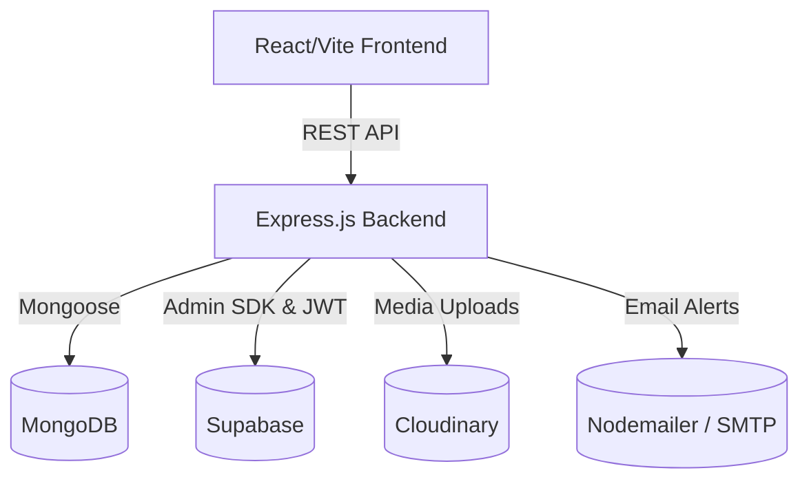

<div align="center">
  <h1 align="center">Disaster Resource Coordination Platform</h1>
  <p align="center">
    A real-time coordination platform designed to streamline disaster response, resource allocation, and communication during critical emergencies.
  </p>
</div>

<details>
  <summary>Table of Contents</summary>
  <ol>
    <li><a href="#about-the-project">About The Project</a></li>
    <li><a href="#technology-stack">Technology Stack</a></li>
    <li><a href="#system-architecture">System Architecture</a></li>
    <li><a href="#getting-started">Getting Started</a>
      <ul>
        <li><a href="#prerequisites">Prerequisites</a></li>
        <li><a href="#installation">Installation</a></li>
        <li><a href="#environment-variables">Environment Variables</a></li>
      </ul>
    </li>
    <li><a href="#deployment">Deployment</a></li>
    <li><a href="#license">License</a></li>
  </ol>
</details>

## About The Project

The **Disaster Resource Coordination Platform** bridges the gap between individuals needing emergency relief, shelters, NGOs, and government response teams. It provides authenticated role-based access, inventory tracking, volunteer roster management, shelter capacity monitoring, and automated request routing.

### Key Features
- **Relief Request Routing**: Automated geographic & workload routing of emergency requests to local NGOs.
- **Role-Based Access Control**: Role support for Citizens, Volunteers, NGO Representatives, and Administrators.
- **Inventory & Resource Management**: Bulk Excel imports, global resource audits, and NGO inventory tracking.
- **Shelter & Volunteer Oversight**: Real-time shelter occupancy tracking and volunteer deployment rosters.
- **Support & Notification Integration**: Nodemailer-powered notifications and integrated contact support.

---

## Technology Stack

### Frontend (Client)
- **Framework:** React 19 + Vite
- **Routing:** React Router v7
- **Styling:** Custom Vanilla CSS Design System with dark mode support
- **Icons & UI:** Lucide React
- **Data & Auth:** Axios, Supabase JS Client

### Backend (Server)
- **Environment:** Node.js (v20+)
- **Framework:** Express.js (ES Modules)
- **Database:** MongoDB (Mongoose ODM)
- **Authentication:** Supabase Auth & JWT middleware
- **File Storage:** Multer & Cloudinary
- **Security & Utilities:** Helmet, CORS, Express Rate Limit, Nodemailer, XLSX, XSS

---

## System Architecture



---

## Getting Started

### Prerequisites
- Node.js v20+
- MongoDB instance (Local or MongoDB Atlas)
- Supabase account & project

### Installation

1. **Clone the repository**
   ```sh
   git clone https://github.com/Adhilpalangad/Disaster-Resource-Coordination-Platform.git
   cd Disaster-Resource-Coordination-Platform
   ```

2. **Install Client & Server Dependencies**
   ```sh
   cd client && npm install
   cd ../server && npm install
   ```

3. **Run Locally in Development**
   ```sh
   # In /server
   npm run dev

   # In /client
   npm run dev
   ```

---

## Environment Variables

### Client Variables (`client/.env`) — *Client-safe*
| Variable | Description | Example |
|---|---|---|
| `VITE_API_URL` | Base URL of backend Express API | `http://localhost:5000/api` |
| `VITE_SUPABASE_URL` | Supabase Project URL | `https://your-project.supabase.co` |
| `VITE_SUPABASE_ANON_KEY` | Supabase Public Anonymous Key | `eyJhbGci...` |

### Server Variables (`server/.env` / root `.env`) — *Server-only Secrets*
| Variable | Description | Required |
|---|---|---|
| `PORT` | HTTP Server port | No (Default: `5000`) |
| `MONGODB_URI` | MongoDB connection URI | Yes |
| `JWT_SECRET` | Secret key for JWT verification | Yes |
| `SUPABASE_URL` | Supabase Project URL | Yes |
| `SUPABASE_ANON_KEY` | Supabase Anonymous Key | Yes |
| `SUPABASE_SERVICE_ROLE_KEY` | Supabase Service Role Key | Yes |
| `CLOUDINARY_CLOUD_NAME` | Cloudinary Cloud Name | Optional |
| `CLOUDINARY_API_KEY` | Cloudinary API Key | Optional |
| `CLOUDINARY_API_SECRET` | Cloudinary API Secret | Optional |
| `SMTP_USER` | SMTP Username / Sender Email | Optional |
| `SMTP_PASS` | SMTP Password / App Password | Optional |
| `SMTP_FROM` | Sender display header | Optional |
| `NOTIFY_TEST_EMAIL` | Test email inbox override | Optional |

---

## Deployment

The application includes production deployment configurations for multiple platforms:

- **Docker / Docker Compose**: Multi-stage production builds for Nginx static client (`docker/client/Dockerfile`) and Node server (`docker/server/Dockerfile`).
  ```sh
  docker compose up --build
  ```
- **Vercel**: `vercel.json` configured for SPA routing.
- **Render**: `render.yaml` blueprint for Server Web Service and Client Static Site.
- **Railway**: `railway.json` configuration for containerized deployment.

---

## License

Distributed under the MIT License. See [`LICENSE`](file:///c:/Users/Adi/.gemini/antigravity-ide/scratch/Disaster-Resource-Coordination-Platform/LICENSE) for more information.
